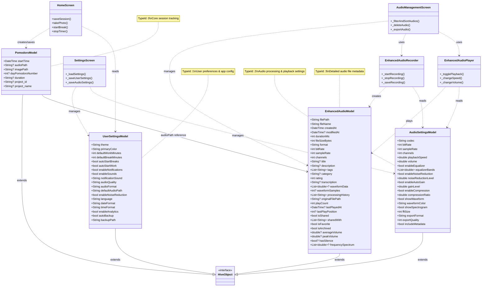
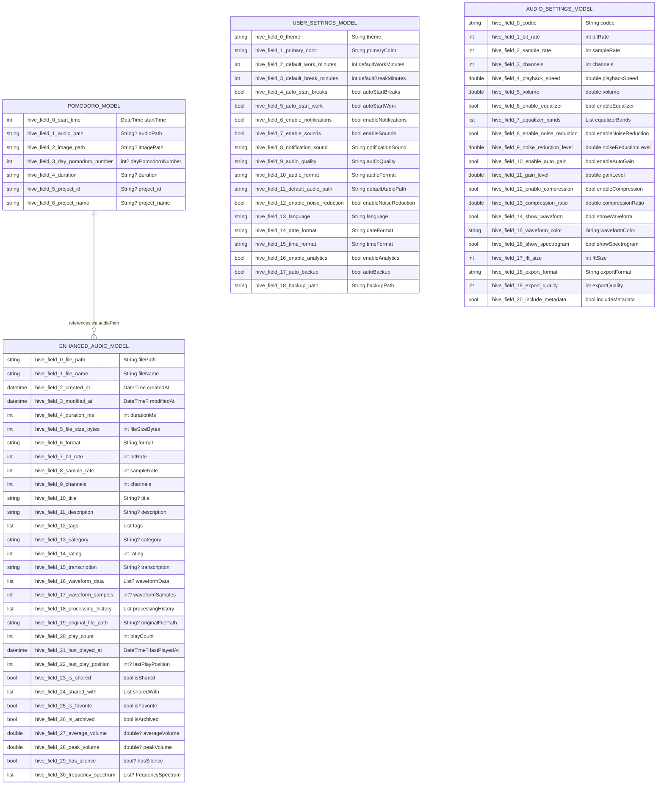

# Data Models Documentation

## Enhanced Model Architecture

The solo level system now features a comprehensive set of models for user settings, audio management, and Pomodoro session tracking.

## Model Relationships



## Database Schema



## Component Architecture

```mermaid
graph TB
    A[HomeScreen] --> B[PomodoroModel]
    A --> C[UserSettingsModel]
    A --> D[EnhancedAudioRecorder]
    
    E[SettingsScreen] --> C
    E --> F[AudioSettingsModel]
    
    G[AudioManagementScreen] --> H[EnhancedAudioModel]
    G --> I[EnhancedAudioPlayer]
    G --> D
    
    I --> H
    I --> F
    D --> H
    D --> F
    
    J[HistoryScreen] --> B
    J --> I
    
    B --> K[(Hive Database)]
    C --> K
    F --> K
    H --> K
    
    L[PomodoroModelAdapter] --> K
    M[UserSettingsAdapter] --> K
    N[AudioSettingsAdapter] --> K
    O[EnhancedAudioAdapter] --> K
    
    D --> P[Audio Files]
    I --> P
    
    B -.-> P : audioPath reference
    H -.-> P : filePath
    
    subgraph "Data Layer"
        B
        C
        F
        H
        K
        L
        M
        N
        O
    end
    
    subgraph "UI Layer"
        A
        E
        G
        J
        I
        D
    end
    
    subgraph "File System"
        P
    end
```

## Model Details

### PomodoroModel (TypeId: 0)
Core model for tracking Pomodoro sessions. Links to audio recordings and images captured during sessions.

**Key Features:**
- Session timing and metadata
- Project organization
- Media attachment references

### UserSettingsModel (TypeId: 1) 
Comprehensive user preferences covering all aspects of the application.

**Categories:**
- **Theme & Appearance**: Dark/light mode, colors
- **Session Defaults**: Work/break durations, automation
- **Notifications**: Alerts, sounds, preferences
- **Audio Preferences**: Quality, format, storage
- **Localization**: Language, date/time formats
- **Privacy**: Analytics, backup settings

### AudioSettingsModel (TypeId: 2)
Detailed audio processing and playback configuration.

**Categories:**
- **Recording**: Codec, bitrate, sample rate, channels
- **Playback**: Speed, volume, equalizer
- **Processing**: Noise reduction, auto-gain, compression
- **Visualization**: Waveform, spectrogram settings
- **Export**: Format, quality, metadata inclusion

### EnhancedAudioModel (TypeId: 3)
Comprehensive audio file metadata with advanced features.

**Categories:**
- **File Properties**: Path, size, format, technical specs
- **Metadata**: Title, description, tags, category, rating
- **Waveform**: Visualization data and analysis
- **Processing**: Edit history, original file tracking
- **Usage**: Play statistics, playback position
- **Organization**: Favorites, sharing, archiving
- **Analysis**: Volume levels, frequency spectrum, silence detection

## Usage Patterns

### User Settings Management
```dart
// Load user settings
final userBox = Hive.box<UserSettingsModel>('userSettings');
final settings = userBox.get('settings') ?? UserSettingsModel();

// Update theme
settings.theme = 'dark';
settings.primaryColor = 'blue';
userBox.put('settings', settings);
```

### Audio Settings Configuration
```dart
// Configure recording quality
final audioBox = Hive.box<AudioSettingsModel>('audioSettings');
final audioSettings = audioBox.get('settings') ?? AudioSettingsModel();

audioSettings.codec = 'aacLc';
audioSettings.bitRate = 256;
audioSettings.enableNoiseReduction = true;
audioBox.put('settings', audioSettings);
```

### Enhanced Audio Management
```dart
// Create enhanced audio model
final audioModel = EnhancedAudioModel(
  filePath: filePath,
  fileName: fileName,
  createdAt: DateTime.now(),
  durationMs: duration.inMilliseconds,
  fileSizeBytes: fileSize,
  format: 'm4a',
  bitRate: 128,
  sampleRate: 44100,
  channels: 1,
  category: 'voice_note',
  tags: ['work', 'meeting'],
);

// Save to database
final audioBox = Hive.box<EnhancedAudioModel>('audioFiles');
await audioBox.add(audioModel);

// Update play statistics
audioModel.incrementPlayCount();
audioModel.addTag('important');
```

### Session Creation with Enhanced Audio
```dart
// Create Pomodoro session with audio reference
final session = PomodoroModel(
  startTime: DateTime.now(),
  audioPath: enhancedAudio.filePath, // Reference to enhanced audio
  imagePath: imagePath,
  dayPomodoroNumber: sessionCount,
  project_id: 'project_001',
  project_name: 'App Development',
);

final pomodoroBox = Hive.box<PomodoroModel>('pomodoros');
await pomodoroBox.add(session);
```

## Advanced Features

### Audio Processing Pipeline
1. **Recording** → AudioSettingsModel configuration applied
2. **Processing** → Noise reduction, auto-gain if enabled
3. **Analysis** → Waveform generation, volume analysis
4. **Metadata** → Title, tags, category assignment
5. **Storage** → EnhancedAudioModel creation and database save

### Search and Filtering
- **Text Search**: Title, filename, tags, description
- **Category Filtering**: voice_note, music, meeting, ambient
- **Status Filtering**: Favorites, archived, shared
- **Sorting**: Date, name, duration, size, play count

### Data Relationships
- PomodoroModel references EnhancedAudioModel via audioPath
- UserSettingsModel provides defaults for AudioSettingsModel
- AudioSettingsModel configures EnhancedAudioRecorder behavior
- EnhancedAudioModel tracks detailed usage and processing history

## Future Enhancements

### Planned Models
1. **ProjectModel** - Detailed project management with goals and milestones
2. **CategoryModel** - Custom audio categories with icons and colors  
3. **GoalModel** - Progress tracking and achievement system
4. **SyncModel** - Cloud synchronization and backup management
5. **AnalyticsModel** - Detailed usage analytics and insights

### Planned Features
1. **AI Integration** - Transcription, summarization, sentiment analysis
2. **Collaboration** - Shared projects and audio comments
3. **Advanced Analytics** - Productivity insights and recommendations
4. **Export/Import** - Data portability and backup/restore
5. **Plugin System** - Third-party integrations and extensions


